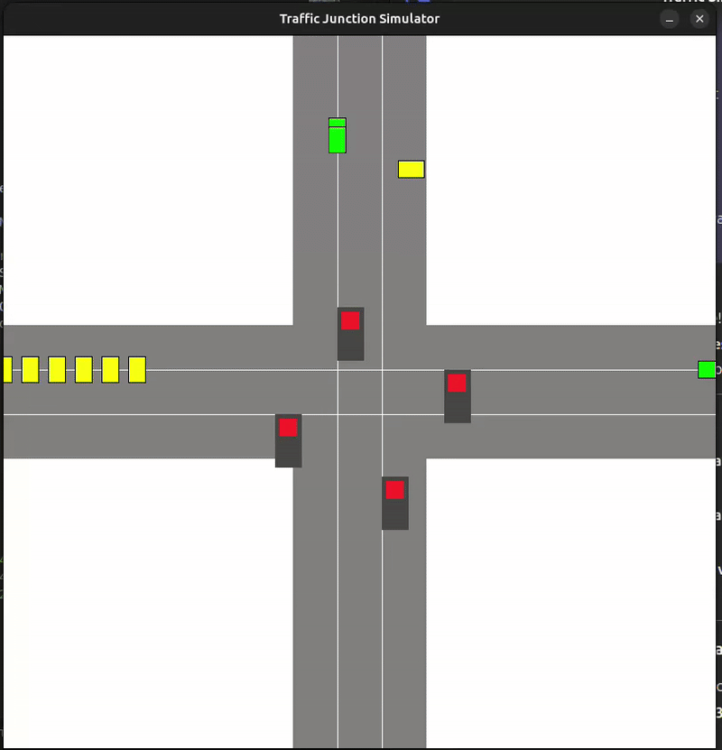

# Traffic Queue Simulator

A real-time traffic(self generated vehicles) intersection simulation that simulates traffic flow at a four-way intersection with traffic lights and multiple lanes. The simulation demonstrates vehicle movement, lane changing, and traffic light management for optimal traffic flow.

## DEMO

## Logic

- Real-time traffic simulation at a 4-way
- Random vehicle generation.
- 3 diff lanes for each 4 roads.
- Lane A3, B3, C3, D3 dequeues their vehicles to respective lane B1, C1, D1, A1 with out need for traffic light.
- Only lane 2 follows traffic lights where it can dequeue as given: 
{A2->C1,D1}
{B2->D1,A1}
{C2->B1,A1}
{D2->B1,C1}
- Here, lane 1 is the incoming lane only.
- Lane A2 is the priority lane which when vehicles count to 5 that lanes priority is set to high and is dequued first.
- For other lanes vehicles are dequeued when the vehicles number is more than 10 until the vehicles counts upto 5.

## Features
- Real-time traffic simultion.
- Dynamic traffic light system.
- Queue based traffic management.
- Priority handling for lane A2.
- Vehicle turing mechanics.

## Prerequisites:
Before running this project, make sure you have the following installed:

- SDL2 Library
- C Compiler (GCC recommended)
- MinGW (for Windows)

## Building and Running
make clean && make && make run

## References:
SDL2 Documentation: https://wiki.libsdl.org/SDL2/FrontPage

SDL2_ttf Documentation:https://github.com/libsdl-org/SDL_ttf